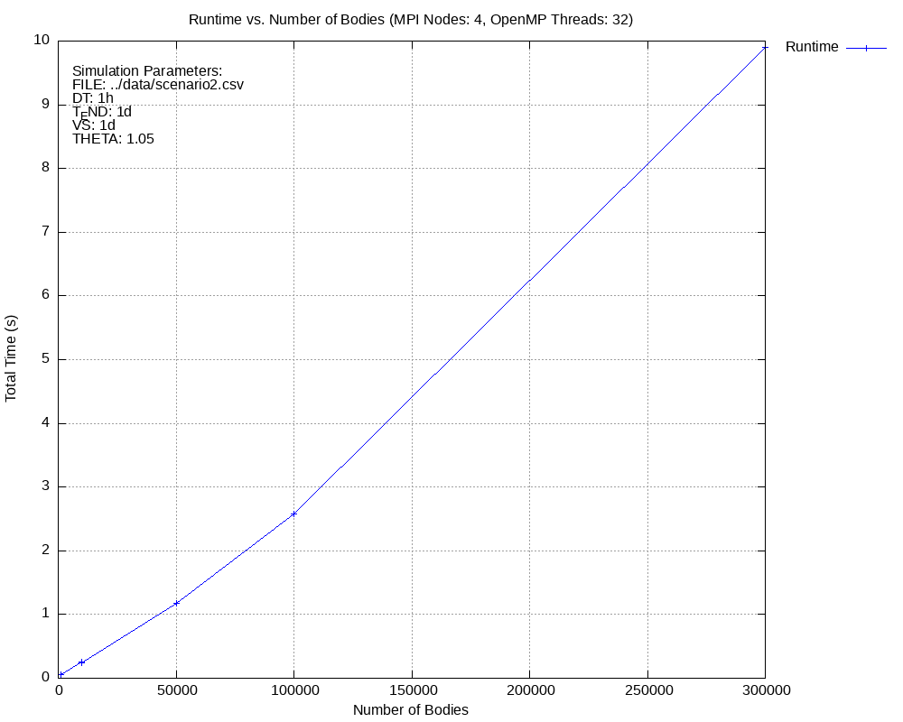
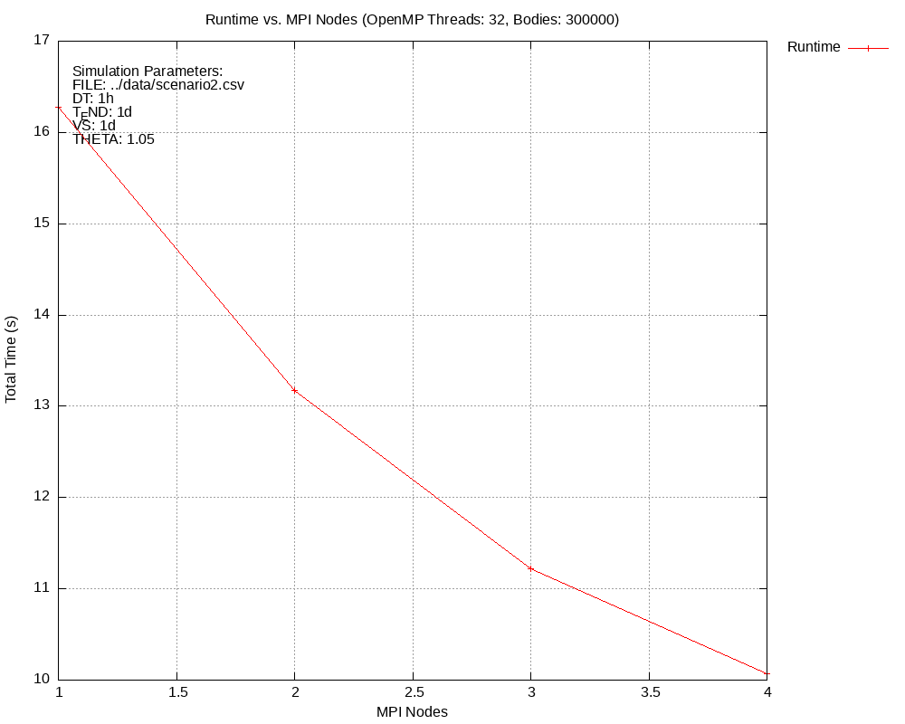
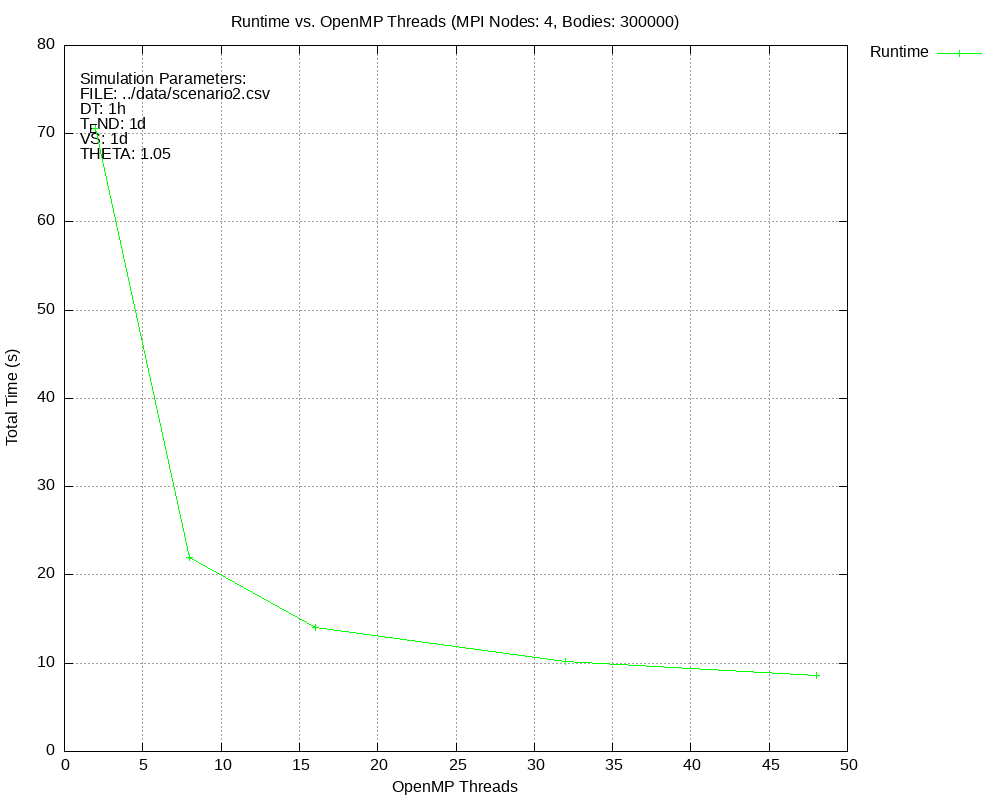
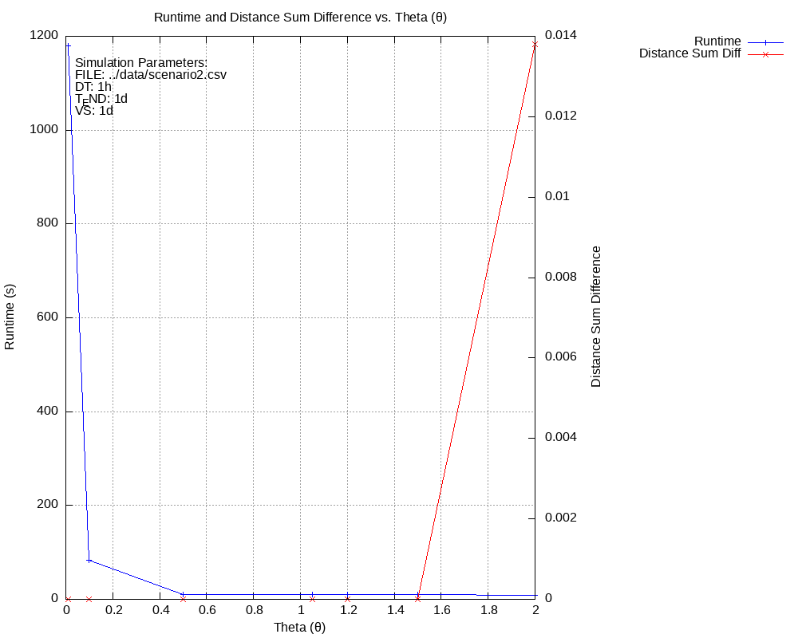

# Parallel N-body Simulation

## Building the Project
To build the project, run:
```bash
mkdir build
cd build
cmake ..
make
```
This builds the executable and tests, which you can run using `ctest`. To check test coverage, run
`
make coverage
`

---

## Approach
- The root process broadcasts the total number of bodies, their masses, initial positions, and velocities to all MPI ranks using `MPI_Bcast`, so all ranks start with the same global data.  
- Masses, positions, velocities, names, and orbit classes are distributed to MPI ranks using `MPI_Scatterv`, giving each rank a subset of bodies to handle.  
- Each rank calculates the initial accelerations for its assigned bodies using their local data and global data (like positions and masses of all bodies) before entering the simulation loop.  

Inside the simulation loop:
- Each rank performs a full-step position update and a half-step velocity update for its assigned bodies.  
- Updated positions are gathered globally across all ranks using `MPI_Allgatherv`, ensuring that every rank has the full updated state of all bodies needed for the next computation.  
- A second half-step velocity update is performed to finalize the integration step.  
- Accelerations are calculated for each body based on the updated global positions using the Barnes-Hut algorithm. 
- Global kinetic and potential energies are calculated by summing contributions from all ranks using `MPI_Allreduce`.  
- Each rank writes VTP files for its assigned bodies, while the root rank manages updates to the PVD file that aggregates all outputs. 

The acceleration calculations, position, and velocity updates are parallelized with OpenMP. We tried parallel octree construction on multiple threads but didn't see performance gains (performs similarly or slightly worse). The implementation is included in this project. 

---

## Results
The datasets (CSV) for Scenario 1 and Scenario 2 are in the `data` folder. The final timestep CSV files for both scenarios, along with screenshots from ParaView, are also in the same folder.

### Scenario 1
```bash
srun --exclusive -N 4 ./simulate --file ../data/scenario1.csv --dt 1h --t_end 12y --vs 2d --vs_dir sim_s1 --theta 1.05 --log
```
The simulation took 25 minutes for ~19,000 bodies (1488.58 seconds for 19,054 bodies).

**Note:** Use the `--log` option to monitor the simulation's progress. To limit the number of bodies, use the `--bodies` option. To get more information, use `--help`.
### Scenario 2
```bash
srun --exclusive -N 4 ./simulate --file ../data/scenario2_306051.csv --dt 1h --t_end 1y --vs 7d --vs_dir sim_s2 --theta 1.05
```
We managed to simulate up to 300,000 bodies in under 30 minutes (1889 seconds for 306,051 bodies).

---

## Benchmarks

### Diagram 1: Runtime vs. Number of Bodies
This shows how runtime changes as the number of bodies increases, with 4 MPI nodes and 32 OpenMP threads.



**Analysis:**  
The runtime increases linearly with the number of bodies. This makes sense because more bodies mean more interactions to calculate.

---

### Diagram 2: Runtime vs. MPI Nodes
This shows how runtime changes as we add more MPI nodes, keeping 32 OpenMP threads and 300,000 bodies.



**Analysis:**  
As more MPI nodes are added, the runtime decreases because the workload is divided across more nodes. However, the speedup is not perfectly linear. We think this might be due to MPI communication or synchronization overhead as more nodes are used.

---

### Diagram 3: Runtime vs. OpenMP Threads
This shows how runtime changes with more OpenMP threads, using 4 MPI nodes and 300,000 bodies.



**Analysis:**  
Runtime improves as more threads are added, especially up to about 32 threads. Beyond that, the gains slow down, likely due to hardware limitations (like core count) and the overhead of managing additional threads.

---

### Diagram 4: Runtime and Distance Sum Difference vs. θ
This compares runtime and accuracy (distance sum difference) as θ changes for a fixed problem with 300,000 bodies, using 4 MPI nodes and 32 OpenMP threads.



**Analysis:**  
For each θ, the final positions of all bodies were summed component-wise at the last timestep and compared to the sum from the run with θ = 0.01 (the reference). Smaller θ values (< 0.5) are significantly slower because they use a stricter Barnes-Hut criterion, allowing fewer approximations. Larger θ values are faster due to more approximations. Interestingly, except for θ = 2.0, there was no difference in the summed positions—all other runs matched the reference exactly.

---

### Diagram 5: Nodes vs. Threads vs. Time
These diagrams provide a combined view of how both MPI node count and OpenMP thread count affect runtime on the same plot. This makes it easy to identify the best combination of nodes and threads.


**Analysis:**  
We can see that the generally the times are decreasing with more nodes and threads. 
However, it's not exactly linear. For scenario 1, we get fastest time using 4 nodes and just 8 threads. 
For scenario 2, different combination give best times like using all 4 nodes, 2 nodes with 32 threads or single node using all threads, etc. Another observation is that as we increase the number of threads, the performance improvement from adding more nodes becomes less. 

---


To replicate these results, run the ./benchmark.sh script. The benchmark uses our dataset for scenario 2, and the results will be saved in the benchmark folder inside the build directory.

