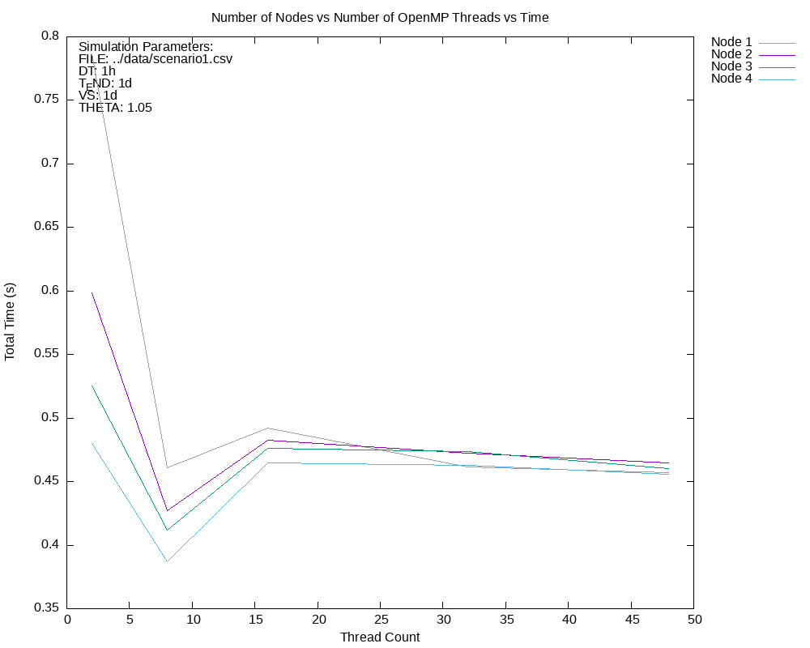
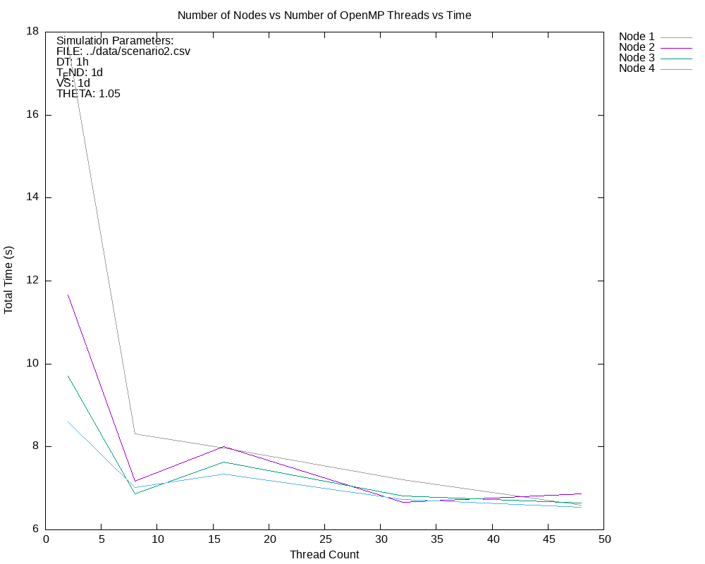

**Parallel N-body simulation**

To build the project, run:
```bash
mkdir build  
cd build  
cmake ..  
make  
```  
This builds the executable and tests, which you can run using `ctest`. To check test coverage, run `make coverage`

---

### Approach
- Masses, positions, and velocities are distributed to processes using `MPI_Scatterv`.  
- Each process updates its local positions and velocities through leapfrog integration.
- We use MPI_Allgatherv to synchronize positions globally.
- Visualization data is periodically gathered to the root process with MPI_Gatherv.
- Inside each process, the updates for velocity and position, as well as the acceleration calculations for local bodies are parallized using OpenMP. 
- We also tried parallel octree construction across threads, but it didn't lead to much improvement (performs almost as well or slightly worse). The implementaiton for it is inluded in the project.
---

### Result
Input files for Scenario 1 and 2 are in the `../data` directory.  The scenario 1 and 2 last timestep csv's can be found in `../data` along with the screenshots from paraview. 

**Scenario 1**  
```bash
srun --exclusive -N 4 ./simulate --file ../data/scenario1.csv --dt 1h --t_end 12y --vs 2d --vs_dir sim_s1 --theta 1.05
```  
Around 25 minutes for ≈19000
(1554 sec for 19054 bodies)


**Scenario 2**  
```bash
srun --exclusive -N 4 ./simulate --file ../data/scenario2.csv --dt 1h --t_end 1y --vs 7d --vs_dir sim_s2 --theta 1.05
```  

We managed to simulate up to 300,000 bodies in under 30 minutes using all 4 nodes. 
(1889 sec for 306051 bodies)

Performance plots comparing node and thread counts with 
simulation time: 





To produce these results, run `./benchmark_srun.sh ../scenario{1|2}.csv` from the repository folder. The results will be written to `benchmark` in the build folder. 


