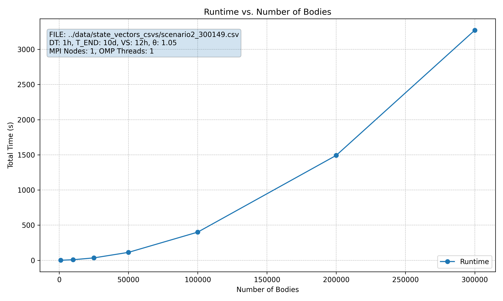
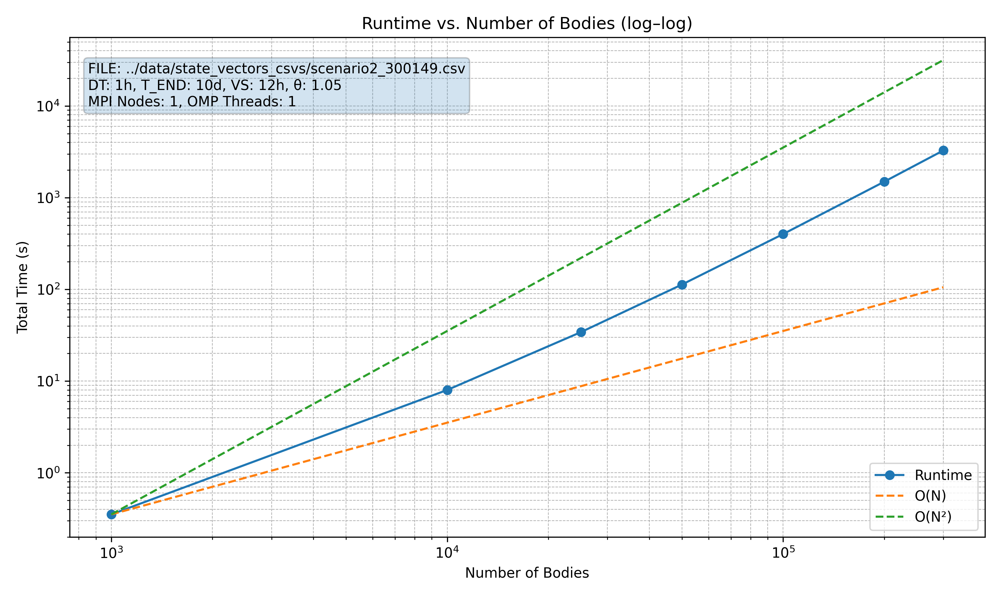
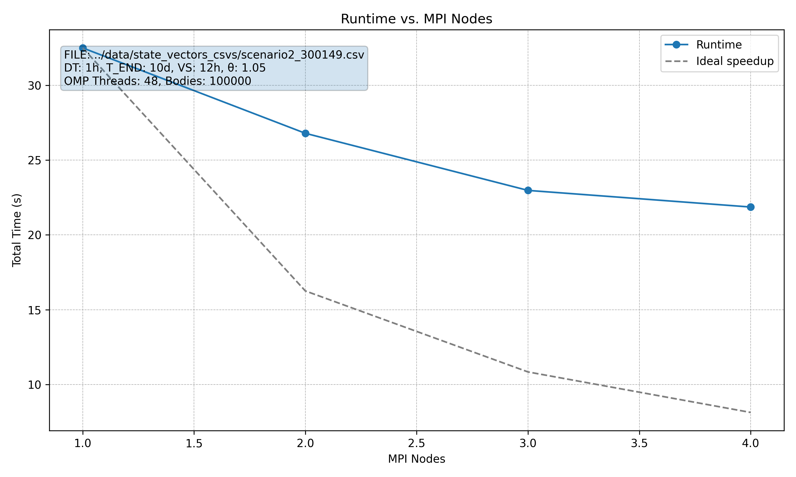
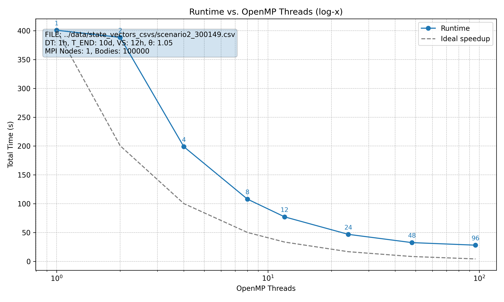
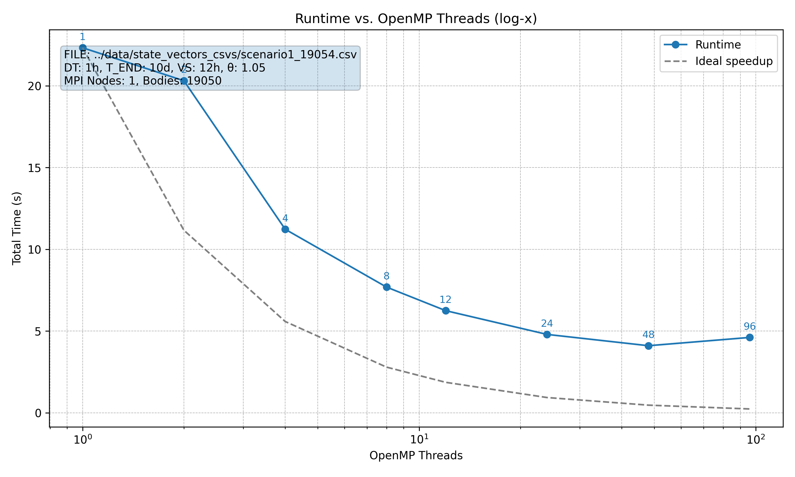
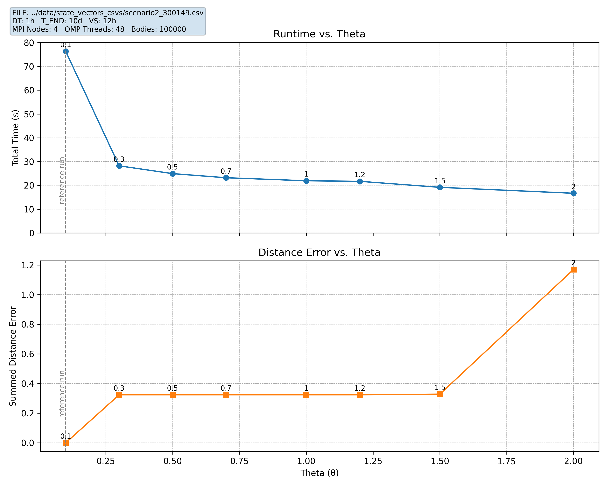

# Benchmarks

## Diagram 1: Runtime vs Number of Bodies

| | |
|:--:|:--:|
|  |  |

The first plot shows the runtime growing from a few seconds to about an hour as we go from 1000 to 300,000 bodies. The upward curve means that the growth is non linear.

The log-log plot confirms the scaling falls between O(N) and O(N²), which matches the expected O(N log N) complexity for the Barnes-Hut. This means the algorithm is more efficient compared to the brute-force N² approach, though runtime still increases faster than linear due to the tree building and traversal.

## Diagram 2: Runtime vs MPI Nodes

This shows how runtime changes as we add more MPI nodes, fixing 48 OpenMP threads and 100,000 bodies.

As more nodes are added, the runtime decreases because the workload is divided across more nodes. However, the speedup is not ideal. This might be due to MPI communication or synchronization overhead as more nodes get used.
The gray line shows the ideal case where doubling the number of nodes would halve the runtime.

## Diagram 3: Runtime vs OpenMP Threads

| | |
|:--:|:--:|
|  |  |

Runtime drops quickly as more threads are used, but the gains get smaller as the thread count increases. For both scenarios, the improvement is steep up to around 24 threads, then levels off. This makes sense since the machine has 24 cores per socket, and going beyond that likely adds overhead. In the smaller scenario, performance even gets slightly worse at 96 threads.

## Diagram 4: Runtime and Distance Sum Difference vs θ

As θ increases from 0.1 to 2.0, runtime keeps decreasing (sharp drop at first and then more gradual) This is expected, since a larger Barnes-Hut threshold allows more approximations which cuts computation time.

Across moderate θ values (about 0.3 to 1.2), the error stays almost flat, which shows that accuracy is not significantly affected in this range. For θ above about 1.5, the error rises rapidly while runtime continues to fall, meaning that very large θ values trade too much accuracy for only a small speedup.
